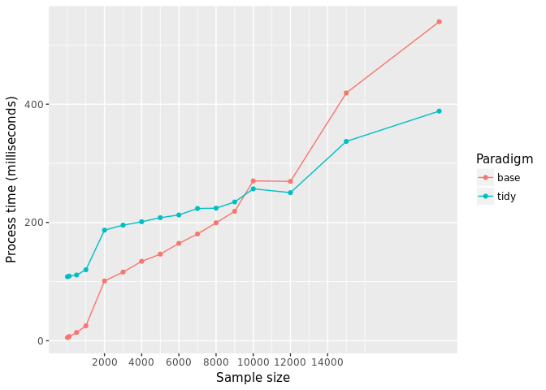
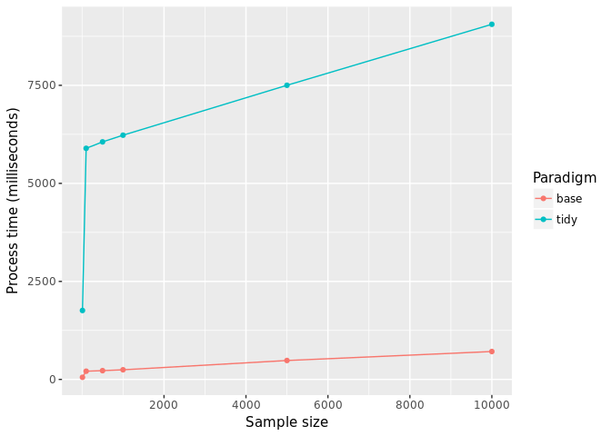

    library(Bluegrass)
    library(dplyr)

    ## 
    ## Attaching package: 'dplyr'

    ## The following objects are masked from 'package:stats':
    ## 
    ##     filter, lag

    ## The following objects are masked from 'package:base':
    ## 
    ##     intersect, setdiff, setequal, union

    library(ggplot2)

Bootstrapping is a good way to explore the distribution of a statistic
through resampling of the original data. Generating the data sets to
conduct the bootstrap analysis is fairly simple, but can be time
consuming. In order to ensure I am using the most efficient methods, the
analysis here is intended to evaluate when using `dplyr` tools may be
advantageous over using `base` tools.

Two sets of functions are defined in the following sections to generate
bootstrapped data sets. The function maintains the capability to do
straight bootstrapping, or to bootstrap by groups. Boot strapping by
groups assumes that you are interested in bootstrapping subject IDs,
where if a subject is included in the sample, all of the observations
from that subject are included.

The primary condition of interest is the size of the data set.

This analysis applies to the `bootstrap_data` function in the
[`Bluegrass` package](https://github.com/nutterb/Bluegrass)

### `base` Function

    bootstrap_data_base <- function(data, groups = character(0), B = 40)
    {
      if (length(groups))
      {
        split_data <- 
        split(data, f = data[groups])
        
        replicate(B,
                  {
                    cluster_select <- sample(seq_along(split_data),
                                             size = length(split_data),
                                             replace = TRUE)
                    do.call(rbind,
                            split_data[cluster_select])
                  },
                  simplify = FALSE)
      }
      else
      {
        replicate(B,
                  data[sample(seq_len(nrow(data)), 
                              size = nrow(data),
                              replace = TRUE), ],
                  simplify = FALSE)
      }
    }

### `dplyr` Function

    bootstrap_data_dplyr <- function(data, groups = character(0), B = 40)
    {
      if (length(groups))
      {
        lapply(X = 1:B,
               FUN = function(i, d, g) single_cluster_bootstrap_dplyr(data = d, 
                                                                      groups = g),
               d = data,
               g = groups)
      }
      else
      {
        lapply(1:B,
               function(i, d) dplyr::sample_n(d, nrow(d)),
               d = data)
      }
    }

    #********************************************************************
    #* UNEXPORTED FUNCTIONS
    #********************************************************************

    single_cluster_bootstrap_dplyr <- function(data, groups)
    {
      data[["..bootstrap_cluster_id.."]] <- 
        data[groups] %>%
        apply(MARGIN = 1,
              FUN = paste,
              collapse = "-")
      
      distinct_cluster_id <- unique(data[["..bootstrap_cluster_id.."]])
      n_cluster <- length(distinct_cluster_id)
      
      cluster_select <- sample(x = distinct_cluster_id,
                               size = n_cluster,
                               replace = TRUE)
      
      lapply(cluster_select,
             function(cl, d = data) 
             {
               dplyr::filter(d, ..bootstrap_cluster_id.. %in% cl)
             }) %>%
        dplyr::bind_rows() %>%
        dplyr::select(-..bootstrap_cluster_id..)
    }

Benchmarking
------------

During the development of this analysis, it was apparent that there
would be a point at which the `dplyr` tools gained the advantage over
`base` tools. In order to identify where that point is, a larger
collection of sample sizes is tested here.

### Simple Bootstrapping

    Bench <- benchmark_size(mtcars,
                            base = bootstrap_data_base(object),
                            tidy = bootstrap_data_dplyr(object),
                            size = c(10, 100, 500, 1000, 2000, 3000, 4000,
                                     5000, 6000, 7000, 8000, 9000,
                                     10000, 12000, 15000, 20000),
                            times = 25)

    ggplot(data = Bench,
           mapping = aes(x = size,
                         y = median,
                         colour = expr)) + 
      geom_line() + 
      geom_point() +
      xlab("Sample size") + 
      ylab("Process time (milliseconds)") + 
      scale_x_continuous(breaks = seq(2000, 14000, by = 2000)) + 
      labs(colour = "Paradigm")

The figure indicates that for data sets of less than 6,000, the `base`
tools are more efficient. Between 6,000 and 10,000, the two sets of
tools are roughly equivalent. After 10,000, the `dplyr` toolset gains
the advantage and appears to maintain the advantage. Based on these
results, for ungrouped bootstraps, I will implement a function that uses
`base` tools for sample sets less than 10,000, and `dplyr` tools for
larger data sets.

### Grouped Bootstrapping

    data(kidney, package = "survival")

    BenchGroup <- benchmark_size(kidney,
                                 base = bootstrap_data_base(object, 
                                                             groups = c("id")),
                                 tidy = bootstrap_data_dplyr(object, 
                                                              groups = c("id")),
                                 size = c(10, 100, 500, 1000,
                                          5000, 10000),
                                 times = 25)

    ggplot(data = BenchGroup,
           mapping = aes(x = size,
                         y = median,
                         colour = expr)) + 
      geom_line() + 
      geom_point() +
      xlab("Sample size") + 
      ylab("Process time (milliseconds)") + 
      scale_x_continuous(breaks = seq(2000, 14000, by = 2000)) + 
      labs(colour = "Paradigm")

For grouped bootstraps, it is pretty apparent that the `base` tools are
superior. It has been suggested in other forums (I don't have links
handy) that `dplyr` tends to slow down noticeably when using large
numbers of groups. This appears to be the case here. It's possible I
could speed up the `dplyr` code using a `do` construct, but since that
is scheduled for deprecation, I won't bother with that. It could be
worth exploring `do`'s replacement when it is released.
