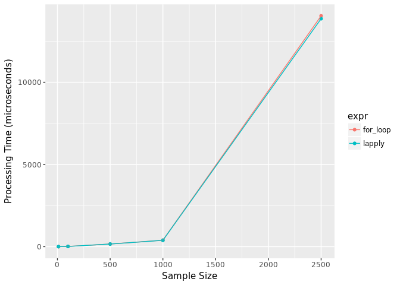

    library(Bluegrass)
    library(ggplot2)

The purpose of this analysis is to determine if using a `for` loop is
more efficient for generating lists of jack\_knife data sets than using
`lapply`.

This analysis applies to the `jackknife_data` function in the
[`Bluegrass` package](https://github.com/nutterb/Bluegrass)

`for` Loop Function
-------------------

    jackknife_for <- function(data){
      jack <- vector("list", nrow(data))
      for (i in seq_len(nrow(data))){
        jack[[i]] <- data[-i, ]
      }
      jack
    }

`lapply` Function
-----------------

    jackknife_lapply <- function(data){
      lapply(seq_len(nrow(data)),
             function(i) data[-i, ])
    }

Comparison
----------

    Benchmark <- 
      benchmark_size(object = mtcars,
                     size = c(10, 100, 500, 1000, 2500),
                     for_loop = jackknife_for(object),
                     lapply = jackknife_lapply(object),
                     times = 25,
                     unit = "ms")

    ggplot(data = Benchmark,
           mapping = aes(x = size,
                         y = median,
                         color = expr)) + 
      geom_point() + 
      geom_line() + 
      xlab("Sample Size") + 
      ylab("Processing Time (microseconds)")

